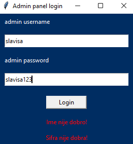
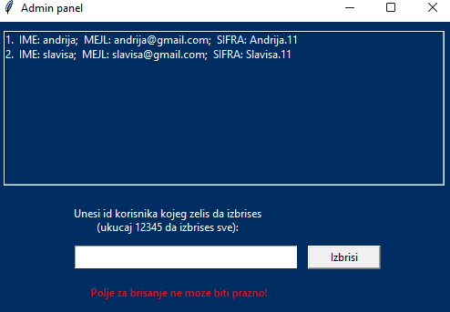
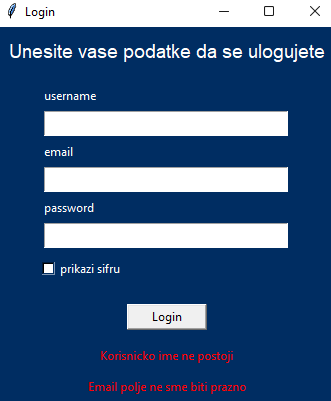
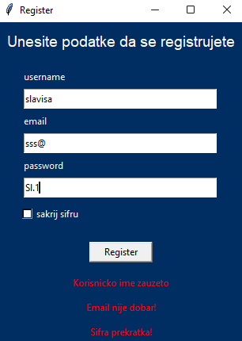
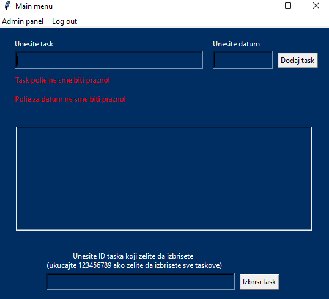
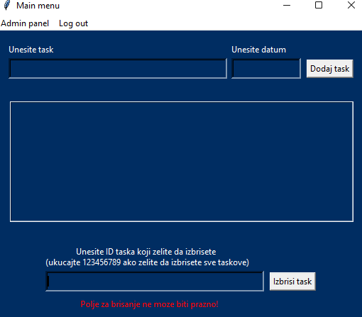

# TO-DO aplikacija
Ovo je jednostavna to-do aplikacija napravljena pomocu pythona i tkintera.

## O aplikaciji
Ova aplikacija sluzi za upravljanje zadacima.
Korisnik moze da gleda, dodaje i brise taskove sa lakocom.
Takodje, oni ostaju u sqlite3 bazi tako da se nece izbrisati cim se program zavrsi.
- **project.py** - glavni fajl gde se pokrece program
- **gui.py** - fajl gde se nalazi ceo korisnicki interfejs
- **functions_for_gui.py** - nalaze se funkcije za gui (npr. validacija za username, email...)
- **login_data.db** - baza podataka
- **requirements.txt** - instalacije koje su potrebne za pokretanje programa
- **img folder** - slike koje sam koristio
- **README.md** - objasnjavanje cele aplikacije (ovaj folder)

## Funkcionalnosti
- Registracija novog korisnika
- Prijavljivanje starog korisnika
- Upravljanje korisnicima putem admin panela
- Gledanje, dodavanje i brisanje taskova sa lakocom
- Provera mejla i sifre preko RegEx
- Dodavanje favicona preko PIL biblioteke
- Cuvanje podataka u sqlite3 tabelama
- Izgled radjen u Tkinteru

## Instalacija
1. Klonirajte repozitorijum:
   ```bash
   git clone https://github.com/your-username/to-do-app.git
2. Promenite folder
    ```bash
    cd to-do-app
3. Instalirajte requirements
    ```bash
    pip install -r requirements.txt
4. Pokrenite program
    ```bash
    python project.py

## Vodic kroz aplikaciju
### root prozor
Kada se aplikacija pokrene, izlazi vam root fajl gde mozete da birate 3 stvari:
    - Admin panela
    - Login 
    - Register

**Admin panel** sluzi da vidite listu svih korisnika, a takodje i mozete da izbrisete jednog ili sve korisnike.
Prvo se ulazi u admin login panel, gde se kucaju username i sifra. Ako jedno od njih dvoje nije dobro, onda izbacuje gresku.

--- 


---
Podaci za logovanje u admin panel:
    - Username: admin
    - Password: admin123

---


---
    
**Login prozor** sluzi da se vec postojeci korisnik uloguje. 
Na njemu se nalaze naslov, polja za unos username, email, i sifre, checkbox koji prikazuje i sakriva sifru i dugme za logovanje.
Login prozor vrsi 4 provere:
1. Da li se username nalazi u bazi podataka
2. Da li je email validan
3. Da li se username i email podudaraju
4. Da li se email i sifra podudaraju
---


---
Nakon sto se korisnik uspesno uloguje, login prozor se zatvara i otvara se main menu.

**Register prozor** sluzi da se novi korisnik registruje.
Na njemu se nalaze naslov, polja za unos username, email, i sifre, checkbox koji prikazuje i sakriva sifru i dugme za registrovanje.
Register prozor vrsi 5 provera:
1. Da li je username validan
2. Da li to ime vec postoji u bazi
3. Da li je email validan
4. Da li se taj email vec nalazi u bazi
5. Da li je sifra validna
---


---
Nakon sto se korisnik uspesno registruje, register prozor se zatvara i otvara se main menu.

### main menu
Main menu je glavni menu. Na njemu mozemo da vidimo 3 sekcije:
1. Sekcija za dodavanje taskova
2. Sekcija za gledanje taskova
3. Sekcija za brisanje taskova

**Sekcija za dodavanje taskova** se nalazi na vrhu.
U njoj se nalaze 2 entry polja (jedan za task, jedan za datum) kao i jedno dugme za dodavanje taska na listu.
Ako je jedno od tih polja prazno, izlazi greska.

---


---

**Sekcija za prikazivanje taskova** se nalazi u sredini. To je jedna lista koja se updajtuje u real-time kada se neki task dodaje i brise. 
Kada se jedan task izbrise (recimo task sa id-em 3) onda se svim taskovima koji imaju veci id od 3, **smanjuje id za 1** (task sa id-em 4 ce postati task sa id-em 3).

**Sekcija za brisanje taskova** se nalazi na dnu. U njoj se nalaze jedno entry polje gde upisujemo id taska kojeg zelimo da izbrisemo (ili mozemo da ukucamo 123456789 da izbrisemo sve taskove) i dugme gde potvrdjujemo brisanje.
Ono takodje izbacuje gresku ako polje za brisanje ostane prazno.

---


---

Na vrhu main menu prozora se nalazi jedan **menu bar**. Na njemu se nalaze 2 stvari:
1. Admin panel (prebacuje se na admin login prozor)
2. Log out (prebacuje se na login prozor)

Dok smo u main menu prozoru, kada stisnemo Enter dugme na tastaturi, to je kao da smo kliknuli dugme za dodavanje taska, a kada stisnemo Delete dugme na tastaturi, to je kao da smo kliknuli dugme za brisanje taska.

## Tehnoglogije koje sam koristio
- Python
- Tkinter za GUI
- sqlite3 za cuvanje podataka korisnika i taskova
- PIL biblioteka za dodavanje favicon-a
- RegEx za validaciju inputa za mejl i sifru

## Moje iskustvo sa ovim projektom
Projekat sam planirao da krenem jos na petoj nedelji predavanja, ali nisam bio samouveren i stalno sam odlagao. 
Na kraju, zapoceo sam ga 5. januara. 
Prvo sam mislio da krenem da radim bankomat ili konvertor valuta jer mi se cinilo laksim zadatkom, ali sam odlucio da uradim tezu to-do listu da bih bolje naucio.
U pocetku sam radio samo logiku, bez GUI-a i to mi je islo odlicno.
Hteo sam da usere i taskove cuvam u csv fajlu jer sam mislio da ce biti lakse, ali sam shvatio da onda ne mogu da postignem ono sto sam zamislio pa sam presao na sqlite3.
Tu sam bio ocajan, nisam znao da radim sa bazama tako da sam ujedno i ucio i radio (vise sam vremena proveo istrazivajuci kako da nesto uradim nego sto sam zapravio radio).
Kada sam to zavrsio, presao sam da radim GUI sa tkinterom. Mislio sam da je mnogo lakse, ali kada sam krenuo, shvatio sam koliko zapravo ne znam da radim sa njim, pa sam opet vise vremena provodio istrazivajuci nego sto sam radio. 
Posle kada sam ga naucio, sve je islo odlicno. Naletao sam cesto na probleme, non-stop sam imao neke bagove, ali sam sve uspeo da ih resim. Jedino sto mi se nije svidjalo je to sto Tkinter-ov GUI i nije nesto bas prelep.
Bicu iskren, koristio sam i ChatGPT, ali sam imao drugaciji pristup. Kada negde zastanem i ne mogu da pronadjem resenje na internetu, ja napisem taj problem u ChatGPT, ali mu nagovestim da mi ne pise kod nego da mi da hint recima. Onda mi on napise da bih mogao da pokusam to i to da uradim, a ja sam smisljam nacim kako da implementiram to.
Zavrsio sam projekat 16. januara.
Sve u svemu, bilo mi je mnogo zanimljivo raditi na ovom projektu i osecam se odlicno sada kada sam ga konacno zavrsio i kada on radi sve sto sam zamislio.

Sve najbolje, 
Slavisa.

**Vreme za izdradu projekta (hh:mm:ss):**
**22:27:56** 


## Autor
Developed by [Slaviša](https://github.com/Slavisa05). (link od github-a)
Slaviša Arsenijević
I001-44/2024